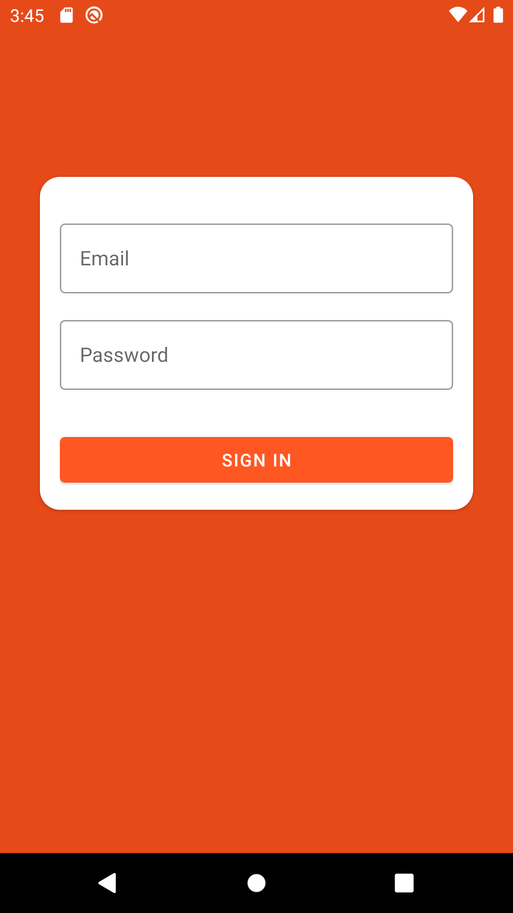
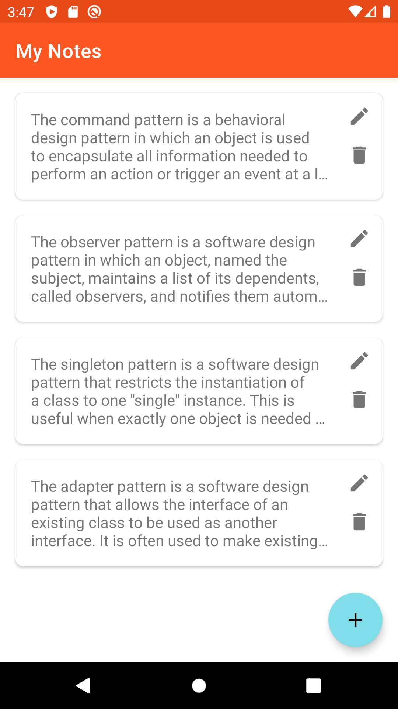
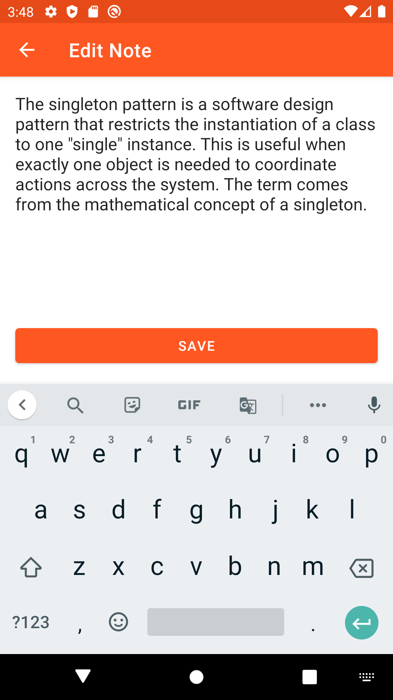
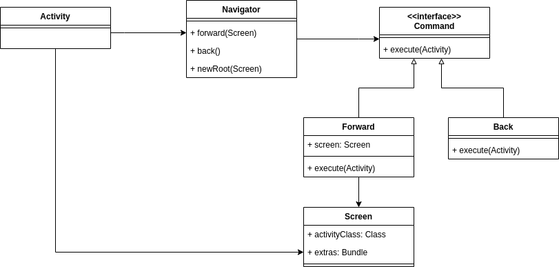

# Notepad - Part 1
COMP 730/830 Lab 7

  

## Objectives
- Learn how to use and implement Command Design Pattern.
- Introduce Firebase features

## Instructions
1. Review the usage of Firebase Cloud Store and Firebase Authentication in the app. 
2. In navigation directory find and `Navigator` class. What is the purpose of this class?
3. Review how navigation is implemented using command pattern. See the diagram below for more details.
   
   
Answer the questions
   * When the commands are executed?
   * How to make new navigation request?
   * What type of navigation commands are currently implemented?
   * What is the purpose of the `Screen` class?

4. Add another type of navigation command `Back`. It doesn't need a screen parameter. All it should do is to finish the activity. 
5. Implement function `void replace(Screen screen)` in Navigator. You don't need a new type of navigation 
   command to perform this action. To replace the screen all we have to go to the next screen and close 
   the previous screen. We can use already existing commands `Forward` and `Back` to make this happen.
   
6. Adjust the rest of the code. Add notes list screen in `Screens`. Update `SignInActivity` so it uses navigator when transitions to the list activity.
